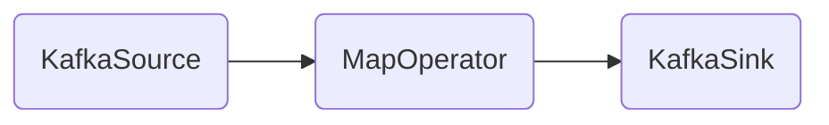

- content
  {:toc}

## 前言

当前团队 Flink 集群使用的版本是`1.7.2`，采用`per job on yarn`的运行模式，在近一年多的使用过程中碰到过多次内存相关的问题，比如：`beyond the 'PHYSICAL' memory limit... Killing container.`，总是感觉`Flink Streaming`在实际场景中的内存管理不够完美，会遇到各样的问题。在`Flink 1.10`版本 release 后，得知该版本对`TaskExecutor`的内存配置做了重新设计，内心有想要去了解的冲动，然而看过社区文档后又有了更多的疑问，比如：`TaskExecutor`对应的 JVM 进程在启动时只会有`-Xmx -Xms -XX:MaxDirectMemorySize`三个内存相关参数是通过 Flink 计算得出的，新增的细粒度配置能给 JVM 这三个启动参数带来多少变化，或是只是一个方便内存计算的工具，对于对 Flink 内存较为了解的人来讲，通过旧的内存配置参数可以完成与新配置一样的效果。

起初这篇文章计划写`Flink Streaming`新/旧内存管理对比相关的内容，然而最近一个月大部分精力被工作和学习 Rust 消耗掉啦，到假期才算有时间开篇；之前在阅读内存管理代码同时参杂读了些任务启动相关代码，所以就扩展下之前计划写的文章范围：以描述`Flink Streaming`整个启动流程为主，辅以内存分配/管理相关代码分析。

## 启动流程分析

**启动流程：** 从脚本提交到任务启动成功（`Flink-Web-Dashboard`展示的任务状态为`running`）的整个流程，这个流程大致分为 3 个`Stage`：

1. `Client`端：封装信息提交给`Yarn`，注册回调函数，轮训 `Job` 状态；
2. `Yarn`分配`Container`启动`AppMaster`；
3. `AppMaster`向`Yarn`申请资源启动`TaskManager`；

**脚本示例：**

```shell
flink run -m yarn-cluster -yn 24 -ys 2 -ytm 6g -ynm $job_name -c $main_class -d -yq ./$job_jar $params
```

**JobGraph：**



-> StreamExecutionEnvironment.execute
-> getStreamGraph
-> getJobGraph
-> deployJobCluster(ClusterSpecification,appName,YarnJobClusterEntrypoint.class,jobGraph,detached)
-> [important] YarnClusterDescriptor.startAppMaster - setupApplicationMasterContainer
-> YarnClient.submitApplication

### [Client] 初始化 Job

```java

// 源码调用流程
[1] -> CliFrontend::main(String[] args)
    -> -> CliFrontend.parseParameters
    -> -> -> CliFrontend.run
[2] -> UserMainClass::main(args: Array[String])
    -> -> StreamExecutionEnvironment.getExecutionEnvironment
    -> -> StreamExecutionEnvironment.addSource
    -> -> DataStream.map
    -> -> DataStream.addSink
[3] -> -> StreamExecutionEnvironment.execute
    -> -> -> StreamExecutionEnvironment.getStreamGraph
    -> -> -> -> StreamExecutionEnvironment.getStreamGraphGenerator
    -> -> -> -> StreamGraphGenerator.generate
    -> -> -> StreamExecutionEnvironment.execute(StreamGraph)
    -> -> -> -> StreamExecutionEnvironment.executeAsync
    -> -> -> -> -> DefaultExecutorServiceLoader.getExecutorFactory
    -> -> -> -> -> YarnJobClusterExecutorFactory.getExecutor
    -> -> -> -> -> YarnJobClusterExecutor.execute
    -> -> -> -> -> -> PipelineExecutorUtils::getJobGraph
    -> -> -> -> -> -> YarnClusterClientFactory.createClusterDescriptor
[4] -> -> -> -> -> -> YarnClusterDescriptor.deployJobCluster
    -> -> -> -> -> -> -> YarnClusterDescriptor.deployInternal
    -> -> -> -> -> -> -> -> YarnClusterDescriptor.startAppMaster
    -> -> -> -> -> -> -> -> -> YarnClientImpl.submitApplication
    -> -> -> -> -> -> return CompletableFuture(new ClusterClientJobClientAdapter)
    -> -> -> -> -> [action] get `JobClient`, invoke `JobListener`, return `JobClient`
    -> -> -> -> [action] create `JobExecutionResult`, invoke `JobListener`, return `JobExecutionResult`

```

**1. 任务提交脚本会触发调用`org.apache.flink.client.cli.CliFrontend::main(String[] args)`，然后依次会执行：**

- 调用`EnvironmentInformation::logEnvironmentInfo`加载 JVM 上线文环境；
- 调用`GlobalConfiguration::loadConfiguration`加载`flink-conf.yaml`配置信息；
- 调用`CliFrontend.loadCustomCommandLines`返回由`GenericCLI`,`FlinkYarnSessionCli`,`DefaultCLI`组成的`List<CustomCommandLine>`对象；`FlinkYarnSessionCli`中包含与`yarn-cluster`提交模式相关，可以通过`Command`命令提交的参数列表，如：`-yid, -ynm, -yqu`等等；
- 调用`CliFrontend.new`创建`CliFrontend`对象，利用`[3]`中的`List<CustomCommandLine>`获取有效可用于解析`Command`参数的`Options`列表，附值给成员变量`customCommandLineOptions`；
- 调用`CliFrontend.parseParameters`，匹配`Command`第一个参数`run`然后调用后序函数；
- 调用`CliFrontend.run`：

  - 解析`Command`参数并封装为`CommandLine`对象；
  - 创建`ProgramOptions`对象，是`Job Command`参数的封装类，持有`CommandLine`解析得来的参数；
  - 将`ProgramOptions`传入`PackagedProgram`的构造函数，创建`PackagedProgram`对象，`PackagedProgram`负责具体具体调用`UserJar`的`Main`函数；
  - 执行`CliFrontend.executeProgram`为任务执行上下文创建`ExecutionEnvironmentFactory`和`StreamExecutionEnvironmentFactory`对象，然后调用`PackagedProgram.invokeInteractiveModeForExecution`方法反射调用`UserJar`的`main`函数，执行具体任务逻辑；

**2. `UserJar`的任务入口函数`UserMainClass::main(args: Array[String])`被调用后，会依次执行：**

- 调用`StreamExecutionEnvironment::getExecutionEnvironment`创建`StreamExecutionEnvironment`和`StreamContextEnvironment`对象；
- 调用`StreamExecutionEnvironment.addSource`创建`DataStreamSource`对象，`DataStreamSource`对象内持有上下文环境中的`StreamExecutionEnvironment`和`StreamTransformation`对象，`StreamTransformation`中持有`FlinkKafkaConsumer`对象；
- 调用`DataStream.map`创建`OneInputTransformation`对象，其内部持有上游的`StreamTransformation`和上线文中的`StreamExecutionEnvironment`对象；最后将`OneInputTransformation`添加到`StreamExecutionEnvironment`的成员变量`transformations`列表中；
- 调用`DataStream.addSink`创建`DataStreamSink`对象，并将其添加到`StreamExecutionEnvironment`的成员变量`transformations`列表中；
- 最后调用`StreamExecutionEnvironment.execute`开始执行`Job`创建和任务提交；

**`StreamExecutionEnvironment.execute`在`Client`端的代码执行流程：**

- 调用`StreamExecutionEnvironment.getStreamGraph`，先创建`StreamGraphGenerator`对象，然后调用`StreamGraphGenerator.generate`生成`StreamGraph`，生成`StreamGraph`流程如下：

  - 根据`Job`和`StreamExecutionEnvironment`的配置以及上下文信息创建`StreamGraph`对象；
  - 遍历`StreamExecutionEnvironment.transformations`，对每个`StreamTransformation`进行解析；
  - 从`StreamTransformation`构建出`StreamNode`并存放到`StreamGraph`对象的成员变量`Map<Integer, StreamNode> streamNodes`中，一个`StreamNode`包含着一个`FlinkOperator`和这个`Operator`运行所需的参数/配置信息；
  - 调用`StreamGraph.addEdge`，构建每个`StreamNode`的`Input StreamEdge` 和`Output StreamEdge`对象，分别添加到`StreamNode`的成员变量`inEdges`和`outEdges`中；
  - `StreamEdge`中包含它上下游`StreamNode`的`Id`值，数据传递规则`ShuffleMode`, `StreamPartitioner`等信息；

- 调用`StreamExecutionEnvironment.execute(StreamGraph)`执行任务提交流程并等待任务状态返回；
- 在`StreamExecutionEnvironment.executeAsync`内通过调用`DefaultExecutorServiceLoader.getExecutorFactory`检索`jar`s 的`META-INF.services`目录，加载适合的`ExecutorFactory`，当前`Job`可用的是`YarnJobClusterExecutorFactory`；
- 通过`YarnJobClusterExecutorFactory`获取`YarnJobClusterExecutor`，然后执行`YarnJobClusterExecutor.execute`：
  - 调用`PipelineExecutorUtils.getJobGraph`将`StreamGraph`转换为`JobGraph`，转换的重要逻辑在`StreamingJobGraphGenerator.createJobGraph`内，创建`JobGraph`的主要操作有：创建一个包有 32 位随机数的`JobID`；为`Graph`的每个顶点生成一个全局唯一的`hash`数（用户可通过`DataStream.uid`设置）；生成`JobVertex`，它是`Flink Task`的上层抽象，包含`Operators`, `invokableClass`, `SlotSharing`，`OperatorChaining`等信息，存放在`JobGraph`的成员变量`taskVertices`中；此外还有, `ExecutionConfig`, `SavepointConfig`, `JarPath`s, `Classpath`s 等信息；
  - 调用`YarnClusterClientFactory.getClusterSpecification`从`Configuration`中解析当前提交`Job`的`JobManager/TaskManager`的内存信息，用于校验`Yarn Cluster`是否有足够的资源分配给`Job`启动；
  - 调用`YarnClusterDescriptor.deployJobCluster`执行具体的`Job`提交流程，返回一个`ClusterClientJobClientAdapter`对象，其内部通过`RestClusterClient`对象与`Yarn Cluster`通信，可获取`Job`状态或是执行一些其它操作；

**4. 调用`YarnClusterDescriptor.deployJobCluster`执行`Job`提交：**

- 调用`YarnClusterDescriptor.deployInternal`代码逻辑阻塞直到`JobManager`提交`Yarn`完成，逻辑如下：

  - 执行`Kerberos`认证（如果有需要）；
  - 校验上下文环境&配置是否满足`Job`提交条件；
  - 查看是否存在合适的`yarn queue`；
  - 校验/适配`ClusterSpecification`（利用集群`Yarn Container vCores/Memory`的配置）；
  - 调用`YarnClusterDescriptor.startAppMaster`启动`AppMaster`（下文详解）；
  - 将`startAppMaster`获得的`JobManager`相关信息和`applicationId`写入`Configuration`；

- 调用`YarnClusterDescriptor.startAppMaster`：

  - TODO

- YarnClientImpl.submitApplication

  - 成员变量`YarnClientImpl.rmClient`通过调用`ConfiguredRMFailoverProxyProvider.getProxy`获取到；
  - TODO

### [Server] 启动 AppMaster

- org.apache.flink.yarn.entrypoint.YarnJobClusterEntrypoint

### [Server] 启动 TaskManager

org.apache.flink.yarn.YarnTaskExecutorRunner

1. onContainersAllocated

## 内存计算

## 参考文档
