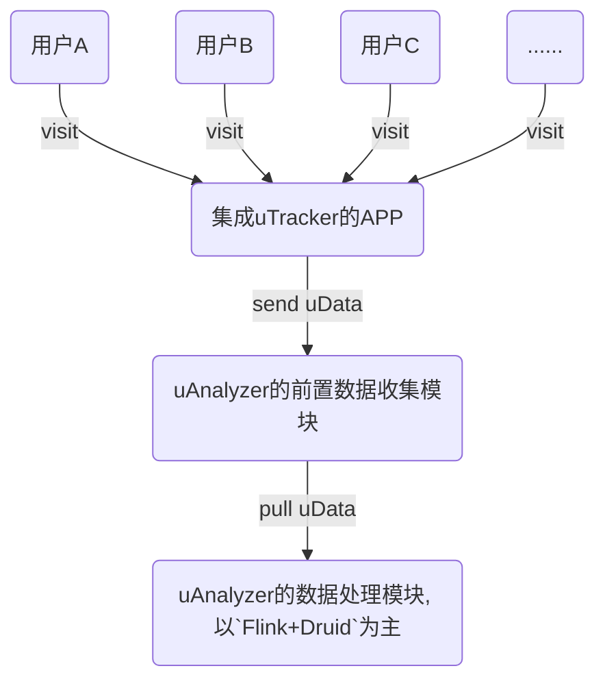
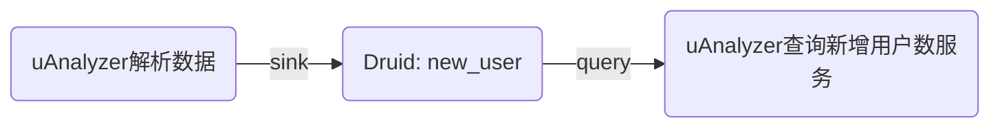

* content
{:toc}

## 说在前面的话：
近来在与两个技术朋友聊天时发现的一个简单有趣的问题，在这做个简短的记录；本文主要围绕问题是什么，在现有技术上下文中如何解决，有哪些优缺点。

**问题预告**：业务层面多个时区的数据如何映射到一张Druid表，查询时满足不同时区客户查询时都能按照各自时区的实际时间来统计数据；

## 问题描述

假设我现在有一套统计分析的`Saas`系统（简称：`TA`），其包含两个模块，用户行为收集模块（简称：`uTracker`）和行为数据统计分析模块（简称：`uAnalyzer`）类似`Google Analytics`或是`Baidu统计`。

**`TA`系统的上下文说明：**
- 首先：`TA`的客户将`uTracker`引入到自己的App中，用以收集使用该APP的用户的行为数据；`uTracker`随着APP的启动而启动并自动收集当前用户行为数据，比如：设备、上下文、访问内容等信息（简称：`uData`），每条`uData`都带有该行为数据生成的时间戳（简称：`dTs`，从设备时钟获取）以及当前设备时钟对应的时区（简称：`dZone`）。
- 其次：`uTracker`将收集上来的数据进行合并、格式化、压缩等操作之后通过手机网络将数据发送到`uAnalyzer`的前置数据收集系统；
- 最终：这这些数据经过`uAnalyzer`系统的清洗、补余，解析等等操作后入到统一的OLAP库中供给客户实时的查询他APP的新增、活跃、留存等指标数据；
- 数据流程描述如下：



- 数据查询服务



**`TA`的客户群体说明**
- 首先：某个客户A来自美国，客户B来自中国，这两家客户都在自己的APP中集成了`uTracker`，并使用我的Saas版`TA`系统；
- 其次：客户A和客户B的APP的用户群体来自世界各地，其数据都发送到我的`uAnalyzer`系统中做统计分析；
- 最后：`TA`系统有10W+的客户在用，假设大多数的客户都有以上两个企业属性；

  *注： 客户A, B其实可类比为亚马逊、淘宝，他们分属不同国家，其用户群体涵盖的是全球范围；*

**问题描述：**
- 为了简化问题，现在限定只针对A,B客户APP在`TA`系统中的`用户新增`指标提出问题；
- `用户新增`指标定义：在客户查询的时间区间内该客户APP新增的用户数量；

客户A是美国客户，其常用的时区为UTC-5；
客户B是中国客户，其常用时区为UTC+8；
客户A,B的`用户新增`指标在同一张`Druid`表（new_user）中；
`Druid`表`new_user`采用的时区是UTC+8，粒度是`DAY`；

客户A的APP所对应的用户主要来自两个区域美国本地UTC-5，中国UTC+8；
客户B的APP所对应的用户同样来自两个区域美国本地UTC-5，中国UTC+8；

**问题**：对于一条美国当地上报的用户数据，若其`uTs`在当地时间（UTC-5时区）是`2018-11-13 12:00:00`则对应的UTC+8时间是`2018-11-14 01:00:00`；其解析到`Druid`表时是按照`Druid`表设置的时区来做`aggregate`的，当前Durid表时区配置是`UTC+8`，则最终入库到`Druid`时会将UTC-5时间`2018-11-13 12:00:00`的数据解析到 到`2018-11-14 00:00:00`的segment（`Druid`表粒度是'DAY'），这就照成了在查询美国时间`2018-11-13`日的`新增用户数`实际是`2018-11-12 11:00:00`到`2018-11-13 13:00:00`的数据。

其实客户需求很简单，按照客户指定的时间区间和时区查询所有新增用户数量（即：全球范围内的新增用户数）；

## 解决方案

- 关键字：  
`dataTs`：日志产生的时间，日志生成时的设备时间戳；  
`dataZone`：接收到的数据中包含的时区，从设备时钟获取；  
`druidZoneConf`：Druid表创建时所设置的时区；  
`appZoneConf`：查询APP指标时期望用的时区；  

### 方案一：校准每条原始日志的时间戳

**示例**：假设某APP的用户分布在中国和美国，其上报数据的时区`dataZone`中包含UTC+8, UTC-5两种时区，Druid表配置的时区`druidZoneConf`是UTC+8，APP设置的查询所用时区`appZoneConf`是UTC-5；
在处理每条原始日志时对`dataTs`进行重新校准，校准好的`newTimestamp`做为Druid入库的时间戳；

伪代码：
```scala
/**
 * Zone(UTC+8) - Zone(UTC-5) = 8 - (-5) = 13
 */
def calibrate = (Zone a, Zone b) => a - b
val newTimestamp = dts + calibrate(appZoneConf, druidZoneConf)
```

**优点**：支持的所有的granularity（时间粒度：秒，分，时，日，周，月，年），代码变动量小，可沿用当前的所有Druid表；  
**缺点**：历史数据没办法处理；APP在创建时必须选择时区且后续无法变更（已入库数据无法适配变更）；

### 方案二：查询时针对查询时间区间进行校准

在数据解析并写入Druid的过程中不对时间戳&时区做干扰处理，在指标查询过程中针对时区进行查询区间的换算；

**示例**：Druid表的存储数据所用的时区是UTC+8，美国用户查看指标采用的时区是UTC-5，查询的时间区间是[2018-11-11, 2018-11-13]，根据时区差异校准后的数据查询区间为[2018-11-11 13:00:00, 2018-11-13 13:00:00]；(druid有针对时区的查询方案，但也要求`<=小时`的粒度)

时间校准伪代码：
```scala
/**
 * Zone(UTC+8) - Zone(UTC-5) = 8 - (-5) = 13
 */
def calibrate = (Zone a, Zone b) => a - b
val newStartTime = startTime + calibrate(appZoneConf, druidZoneConf)
val newEndTime = endTime + calibrate(appZoneConf, druidZoneConf)
```

*注*：`Druid`本身的查询也支持时区的转换，可参照如下链接： [http://druid.io/docs/latest/querying/granularities.html](http://druid.io/docs/latest/querying/granularities.html)

**优点**：不修改原始数据的时间戳，不造成歧义容易理解；筛选数据所用时区可随意变更，无历史数据迁移问题；  
**缺点**：只支持部分granularity（时间粒度：秒，分，时），其他粒度（天，月，周，年）不支持，需要对表进行重新的设计规划；
**此外**：一些国家使用非整数的时区，如：印度使用的是UTC +5:30，这时在使用方案二前提下无法去查询`roll-up by HOUR`的表；
## 对比总结

若在系统建设初期没考虑到跨时区等问题，到后期再更正就有存在比较大的工作量投入，且牵涉到历史数据处理迁移的问题；方案一是较为简单治标方案，比较适用于已有系统的变更；方案二则是一个比较能治标治本的方案，但需要在项目初期规划时候就考量进去，同时遇到数据量特别大的场景也需要将性能纳入考量，毕竟对同一个`Druid Schema`来讲粒度从`DAY`变为`HOUR`数据最大增长24倍；

## 引用&参考

- [1]. [define timestamp](https://baike.baidu.com/item/时间戳)
- [2]. [query druid with timezone](http://druid.io/docs/latest/querying/granularities.html)
- [3]. [create druid ingestion spec with timezone ](http://druid.io/docs/latest/ingestion/ingestion-spec.html)
