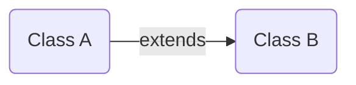
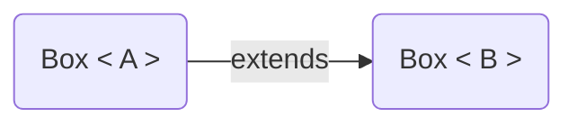
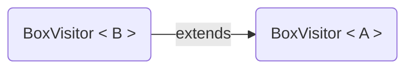

* content
{:toc}

## 前言

第一次听说`协变&逆变`是刚接触`Scala`的时候，但`协变&逆变`却不是`Scala`所特有的，`Java`, `C#`等语言也有`协变&逆变`的概念，本文首先会解释`协变&逆变`这两个术语的含义，然后进一步探讨它们在`Scala`中具体的书写语法和使用场景。

## 术语讲解

`协变&逆变`的概念入门可以关注下边这两个篇文章，本段内容也是学习这两篇文章所得到的：[Covariance and Contravariance of Hosts and Visitors](https://www.clear.rice.edu/comp310/JavaResources/generics/co_contra_host_visitor.html), [Cheat Codes for Contravariance and Covariance](https://www.originate.com/thinking/stories/cheat-codes-for-contravariance-and-covariance/)。

- 定义三个`实体`：`Fuel`,` Plant`, `Bamboo`；图中的符号`>`表示可替代性（类比多态：子类可作为父类使用），`Plant`可以做为这一种`Fuel`（燃料），`Bamboo`是一种`Plant`，在作为燃料的这件事情上也可以认为 `Bamboo extends Plant`, `Plant extends Fuel`；
- 定义`Box`：用于实体（`Fuel`,` Plant`, `Bamboo`）的存放；

- 定义三个可消费实体的`消费者`：`Burn`, `Animal`, `Panda`；

<br/>

```java

/** box contains entities */
class Box<T> {
  /**
   * 若有一个Box<Plant>，可以用BoxVisitor<Fuel,_>, BoxVisitor<Plant,_>来消费他，不能用BoxVisitor<Bamboo,_>来消费；
   * 对于BoxVisitor来讲T是逆变的，只能接收类型为T或T父类的BoxVisitor，即BoxVisitor<? super T>；
   *
   */
  public <R> R accept(BoxVisitor<? super T, ? extends R> visitor) {
      return null;
  }
}

/** consume entities in box */
class BoxVisitor<U, R> {
    public R visit(Box<? extends U> box) {}
}

class Burn<R> extends BoxVisitor<Fuel, R> {
  /**
   * 对于Burn而言，它可消费Fuel,Plant,Bamboo，所以visit可接收任何有Fuel属性的Box；
   * 由此Box<T>可以被认为是`协变`的，即如果T extends U 则 Box<T> extends Box<U>
   */
  public R visit(Box<? extends Fuel> box) {}
}

```

- **协变**

`Burn`可以燃烧一切包括：`Fuel`, ` Plant`, `Bamboo`；`Animal`可以吃所有类型的植物包括：`Plant`, `Bamboo`；`Panda`只吃一种植物：`Bamboo`。由此，可得出下面这关系张图：


如果消费者是`Burn`，我可以把`Box<Fuel>`, `Box<Plant>`, `Box<Bamboo>`传递给它；如果消费者是`Animal`，我可以把`Box<Plant>`, `Box<Bamboo>`传递给它；如果消费者是`Panda`，我可以把`Box<Bamboo>`传递给它。

对于`Box<T>`而言，它存储的实体对象用于被使用/消费，所以它是一个生产者，若能将`Box<Fuel>`传给某个`BoxVisitor`，则也能将`Box<Plant>`, `Box<Bamboo>`传递给这个`BoxVisitor`，这时`Box<Fuel>`中的泛型是上界（`upper bound`），需要用`extends`关键字来定义`Box<T>`的范围，该范围能被上文中的`BoxVisitor`消费。即，若`BoxVisitor`能接收装满`T`的`Box`，则肯定能接收装满`T`子类的`Box`（`Box<T>`是生产者，`remember: Prdoucer Extends`），`Box<T>`随着它的泛型`T`进行协变，协变的简单定义：

如果：



则：



**注：**：Java中的数组是协变的，如下列Java代码可正常编译，但运行时会抛出`ArrayStoreException`：

```java
Box.Bamboo[] bamboos = new Box.Bamboo[1];
bamboos[0] = new Box.Bamboo();
Stream.of(bamboos).forEach(System.out::println);
Box.Plant[] plants = bamboos;
plants[0] = new Box.Plant();
// throw ArrayStoreException at running stage.
Stream.of(plants).forEach(System.out::println);

```

- **逆变**
可以将装满`Fuel`的`Box`，传递给`Burn`（汽油只可以燃烧）；可以将装满`Plant`的`Box`传递给`Burn`, `Animal`（植物可以燃烧&吃）；可以将装满`Bamboo`的`Box`传递给`Burn`, `Animal`, `Panda`（竹子可以燃烧，可以给动物&熊猫吃）。由此我们可以得出下面的这张图：


如果我有`Box<Fuel>`，我可以把它传递消费者`Burn`；如果我有`Box<Plant>`，我可以把它传递给消费者`Animal`, `Burn`；如果我有`Box<Bamboo>`，我可以把它传递给消费者`Panda`, `Animal`, `Burn`。

对于`BoxVisitor<T>`本身而言，它是一个可消费`<T>`的消费者，若一个`Box<Bamboo>`能被`Panda`（即: `BoxVisitor<Bamboo>`）消费，则其必然也能被`Animal`（即: `BoxVisitor<Plant>`）, `Burn`（即: `BoxVisitor<Fuel>`）消费，`BoxVisitor<Bamboo>`中的泛型`Bamboo`是`BoxVisitor`的下界（`lower bound`），需用`supper`来定义`BoxVisitor<T>`中`T`的取值范围，这个范围内的`BoxVisitor`都可用于消费`Box<T>`（`BoxVisitor<T>`是消费者，`remember: Consumer Super`），`BoxVisitor<T>`是逆变的，逆变简单定义：

如果：


则：

`BoxVisitor<Parent> extends BoxVisitor<Child>`



## Scala语法讲解

协变&逆变在`Java`中并没有上升到语法层面，而`Scala`在语法层面对协变&逆变进行的详细的语法设计，`Scala`中用类型参数`[T]`表示不变，`[+T]`表示协变，`[-T]`表示逆变，具体`Scala`中协变&逆变的语法特性&约束会在下文进行详细的分析讲解。

定义若干类结构：

```scala
class Fuel
class Plant extends Fuel
class Bamboo extends Plant

// 声明类型`Box`，其类型参数`T`是协变的
class Box[+T](ts:T*)
// 类型参数逆变
class BoxVisitor[-T]
```

### 协变（covariant）

一个类可被定义为`协变`的前提是：这个类型类似`Producer Extends`，并且是只读的（`read-only`），若非只读则会出现如下问题场景（`ArrayStoreException`异常）：

```scala
// 假设Array是协变的
// 创建一个Circle数组并装入10个Circle对象
val circles: Array[Circle] = Array.fill(10)(Circle(..))
// 当Aarry[T]是协变时该行代码有效
val shapes: Array[Shape] = circles
// 将数组中第一个元素修改为Square对象（Square is a subtype of Shape）
// 若协变非read-only,此处编译通过，但运行会抛异常（向Array[Circle]添加Square对象，这是不被允许的）
shapes(0) = Square(..)
```

**子类对象赋值给父类变量**

因为`Bamboo <: Plant <: Fuel`而且`Box[+T]`是`协变`的，所以`Box[Bamboo] <: Box[Plant] <: Box[Fuel]`，同时由多态原则：子类可看做父类，最终得出下边有效代码：

```scala
val bamboos: Box[Bamboo] = new Box[Bamboo](new Bamboo())
// 根据协变特性，下列代码可正常运行
val plants: Box[Plant] = bamboos
val fuels: Box[Fuel] = bamboos
```

**协变类型内部函数限定**

```scala
/**
 * covariance：readonly, non-writable
 * 即：入参：限定不能将A & A的子类传递给Foo
 * 返回值：无限制
 */
trait Foo[+T] {
  // def fun[①](②)(op: ③): ④
  def fun0[U >: T](u: U)(op: T => U): U
  def fun1[U >: T](u: U)(op: T => U): U => T
}

```

定义的协变类`Foo[+T]`，类内部定义函数的通式包含着组成函数的所有元素：①：类型参数定义，②：对象类型入参定义，③：函数类型的入参定义，④：返回值/函数定义，在协变类里每个位置的条件限制如下：
①类型参数：不能定义子类类型`[U]`（`[U <: T]`），原因：Covariant type T occurs in contravariant position in type T of value U；
②对象入参：入参的类型不能为`T` & `subType of T`，原因：Covariant type T occurs in contravariant position in type T of value u；
③函数入参：函数的出参不能为`T` & `subType of T`，原因：Covariant type T occurs in contravariant position in type U => T of value op；
④返回值：无限制；
④返回函数： 函数入参不能为`T` & `subType of T`，原因：Covariant type T occurs in contravariant position in type T => T of value fun；

*In A Picture:*

逆变位置：只允许定义或传入`super T`的类型，或是与`T`无父子关系的类型；
协变位置：对类型无限制，可任意定义；
个人理解：`协变`可看做生产者`Producer Extends`并且 `readonly`；所以协变类内部不能存在`add(_ extends T)`的函数，对函数的返回值则无限制，所以就有了上图中的语法约束；

### 逆变（contravariance）
`逆变`是与`协变`相对的一个概念，可以将`逆变`看做消费者`Comsumer super`，并且是`write-only`的，若非`write-only`会出现如下问题场景：

```scala
// 假设Array是逆变的
// 首先创建数组并装入Shape对象
val shapes: Array[Shape] = Array.fill(10)(Shape(..), Shape(..))
// Works only if Array is contravariant
val circles: Array[Circle] = shapes
// 编译异常，circles(0)实际是Shape对象，是Circle的父类
val circle: Circle = circles(0)
```

**父类对象赋值给子类变量**

```scala
  // 由于BoxVisitor是逆变的，所以下边代码可正常编译运行
  val fuelVisitor: BoxVisitor[Fuel] = new BoxVisitor[Fuel]
  val plantVisitor: BoxVisitor[Plant] = fuelVisitor
  val bambooVisitor: BoxVisitor[Bamboo] = fuelVisitor
  // 作为消费者，能消费类型`T`则必定能消费T的父类，但不一定能消费子类，
  // 因为子类在拥有所有父类可被外部访问的变量和方法的同时扩展或覆盖了父类的变量和方法
```

**逆变类型的内部函数限定**

```scala
/**
 * contravariance：write-only, non-readable
 * consumer super
 */
trait Foo[-T] {
  // def fun[①](②)(op: ③): ④
  def fun0[U <: T](u: U)(op: U => T): U
  def fun1[U <: T](u: U)(op: U => T): T => U
}
```

在逆变类`Foo[-T]`中函数通式（`def fun[①](②)(op: ③): ④`）的各位置的条件限制如下：
①类型参数：不能定义父类类型`[U]`（`[U >: T]`），原因：Contravariant type T occurs in covariant position in type T of value U；
②对象入参：无限制；
③函数入参：函数的入参不能为`T` & `superType of T`，原因：Contravariant type T occurs in covariant position in type T => U of value op；函数出参无限制；
④返回值：不能为`T` & `superType of T`，原因：Contravariant type T occurs in covariant position in type T of value fun；
④返回函数： 函数出参不能为`T` & `superType of T`，原因：Contravariant type T occurs in covariant position in type U => T of value fun1；

*In A Picture:*

协变位置：只允许定义或传入`extends T`的类型；
逆变位置：对类型无限制，可任意定义；
个人理解：`逆变`可看做消费者`Consumer super`并且 `writeonly`；所以协变类内部不能存在`return (_ extends T)`的函数，对函数的入参则无限制，所以就有了上图中的语法约束；

### 不变（invariance）

`不变`就是平时常见的类型参数，比如`ListBuffer[T]`, `ArrayBuffer[T]`等都是不变的，可以对它们进行 `read` & `write`等操作，只要满足严格的类型约束要求即可；

### 协变逆变应用
scala中常见的`协变`/`逆变`类有：`List[+T]`,  `Seq[+A]`, `Option[+A]`, `Future[+T]`, `Tuple[..]`, `Map[A, +B]`, `Function1[-T1, +R]`, `CanBuildFrom[-From, -Elem, +To]`, etc.

`Function1[-T1, +R]`的另一种常见写法`-T1 => +R`（入参逆变，出参协变）

**示例**

```scala
def main(args: Array[String]): Unit = {
    // 协变
    val list = List[String]("A", "B", "CC")
    println(toInt(list))
    // 协变&逆变组合
    val fun = (v1: CharSequence) => v1.toString.map(_.toInt)
    println(toInt(fun, "ABC"))
  }
  // 协变，入参类型允许的范围`List[_ <: CharSequence]`
  def toInt(list: List[CharSequence]): Seq[Int] = list.map(_.length)
  // 协变&逆变组合使用，第一个入参类型允许的范围`Function1[_>:String, _<:Seq[Int]]`
  // 第一个入参类型范围的另一种表示：`_ >: String => _ <:Seq[Int]`
  def toInt(fun: String => Seq[Int], in: String): Seq[Int] = fun(in)
```

### 总结

本文主要对`协变`，`逆变`进行了详细的语法讲解&场景演示，但这些只是开始，大家需在平时工作中多结合应用场景多练习才能达到灵活运用的目的；此外`协变`，`逆变`只在`scala`编译期进行语法校验，不影响`runtime`，编译出的字节码会被部分裁切以满足`JVM`字节码规范。

本文示例的代码存储在工程：https://github.com/itinycheng/jvm-lang-tutorial ，包`com.tiny.lang.java.generic.variance` 和 `com.tiny.lang.scala.generic.variance`中。

### 参考
- [https://typelevel.org/blog/2016/02/04/variance-and-functors.html](https://typelevel.org/blog/2016/02/04/variance-and-functors.html)
- [https://www.clear.rice.edu/comp310/JavaResources/generics/co_contra_host_visitor.html](https://www.clear.rice.edu/comp310/JavaResources/generics/co_contra_host_visitor.html)
- [https://stackoverflow.com/questions/27414991/contravariance-vs-covariance-in-scala](https://stackoverflow.com/questions/27414991/contravariance-vs-covariance-in-scala)
- [https://yq.aliyun.com/articles/111741](https://yq.aliyun.com/articles/111741)
- [https://www.zhihu.com/question/35339328](https://www.zhihu.com/question/35339328)
- [https://stackoverflow.com/questions/2723397/what-is-pecs-producer-extends-consumer-super](https://stackoverflow.com/questions/2723397/what-is-pecs-producer-extends-consumer-super)
- [https://docs.scala-lang.org/tour/variances.html](https://docs.scala-lang.org/tour/variances.html)
- [https://docs.microsoft.com/zh-cn/dotnet/standard/generics/covariance-and-contravariance](https://docs.microsoft.com/zh-cn/dotnet/standard/generics/covariance-and-contravariance)
- [https://my.oschina.net/xinxingegeya/blog/486671](https://my.oschina.net/xinxingegeya/blog/486671)
